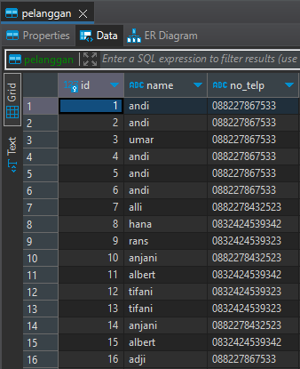

# Basic SQL

## Create Table

Contoh SQL untuk membuat tabel baru bernama pelanggan dan comments :

```sql
create table pelanggan (
	id varchar(100) not null,
	name varchar(100) not null,
	primary key (id)
)
```

```sql
create table comments (
	idcomment int not null auto_increment,
	email varchar(100) not null,
	comment varchar(100) not null,
	primary key (idcomment)
)
```

## Alter

Contoh alter untuk menambah kolom :

```sql
alter table pelanggan 
add no_telp varchar(100) not null
```

Contoh alter untuk modifikasi kolom :

```sql
alter table pelanggan 
modify column id int not null auto_increment;
```

Contoh alter untuk menambahkan kolom foreign key bernama id\_2 di tabel\_A yang nilainya dari kolom id di tabel\_B :

```sql
alter table table_A
add constaint table_B
foregn key id_2 references table_B(id)
```

## Select

Asumsikan tabel pelanggan telah memiliki data sebagai berikut :

<figure><figcaption></figcaption></figure>

Untuk mendapatkan data kolom id, name dan no\_telp dari tabel pelanggan dapat menggunakan query berikut :

```sql
select id, name, no_telp from pelanggan
```

## Select Distinct

Untuk mendapatkan data-data yang tidak duplikat dari kolom name tabel pelanggan dapat menggunakan query berikut :

```sql
select distinct name from pelanggan;
```

Untuk mendapatkan data-data yang tidak duplikat dari kolom name dan no\_telp tabel pelanggan dapat menggunakan query berikut :

```sql
select distinct name, no_telp from pelanggan;
```

Perlu di ingat, jika misal di kolom name terdapat 20 data _distinct_ (data tidak duplikat) dan kolom no\_telp terdapat 30 data _distinct_. Maka jumlah data yang terpilih akan menjadi 30, menyesuaikan kolom dengan jumlah data _distinct_ terbanyak.&#x20;

## Insert

Untuk insert data baru ke tabel pelanggan dapat menggunakan query berikut :

```sql
insert into pelanggan (name, no_telp) values ("andi", "088227867533")
```

## Update

Untuk update data dari tabel pelanggan dapat menggunakan query berikut :

```sql
update pelanggan SET name = "umar" , no_telp = "089932943287" where id = 1
```

## Delete

Untuk menghapus data 1 baris dari tabel pelanggan dapat menggunakan query berikut :

```sql
delete FROM contact where id = 1
```

## Insert Query di Golang

Ada kalanya suatu client dapat melakukan _sql injection_, yaitu dengan mengeksekusi query SQL yang tidak sesuai dengan niat untuk membobol keamanan. Untuk menghindari SQL injection gunakan tanda "?" pada query seperti berikut.

```sql
insert into comments (email, comment) value (?,?)
```

```sql
update contact SET name = ?, no_telp = ? where id = ?
```

```sql
delete FROM contact where id = ?
```

Pada pgx (PostgreSQL Database Driver) dapat juga menggukan operator $1, $2, dst.

```sql
insert into comments (email, comment) value ($1,$2)
```

```sql
update contact SET name = $1, no_telp = $2 where id = $3
```

```sql
delete FROM contact where id = $1
```

Reference :

[https://www.w3schools.com/SQL](https://www.w3schools.com/SQL)

[https://www.w3schools.com/Sql/trysql.asp?filename=trysql\_select\_no\_distinct](https://www.w3schools.com/Sql/trysql.asp?filename=trysql\_select\_no\_distinct)
