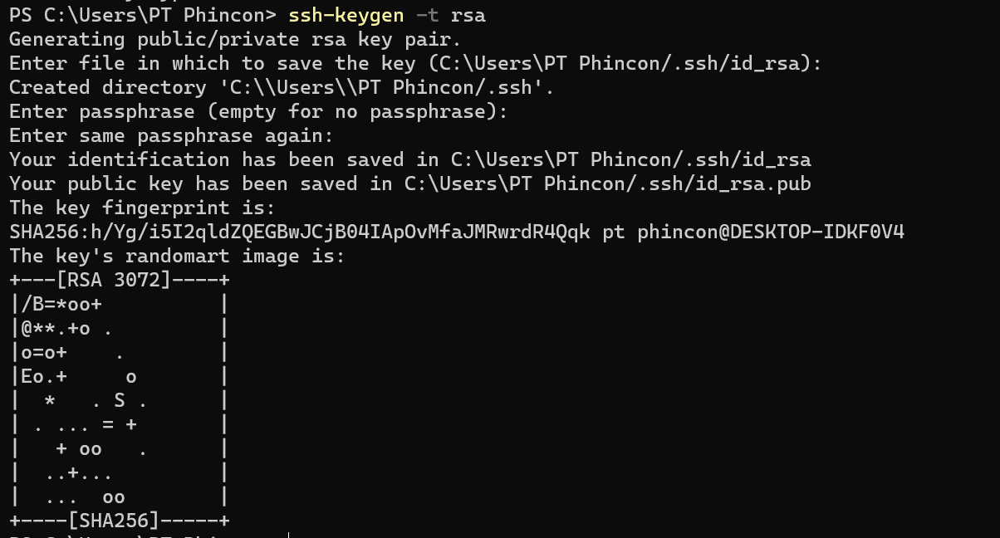

# Git Clone dengan SSH

Buka terminal lalu ketik `ssh-keygen -t rsa`, selanjutnya tekan enter sampai key fingerprint berhasil di generate.

<figure><figcaption></figcaption></figure>

Kemudian masuk ke menu Settings di menu bagian kanan bawah.

<figure><figcaption></figcaption></figure>

Selanjutnya buka tab SSH and GPG keys, lalu klik New SSH key.

<figure><figcaption></figcaption></figure>

Tambahkan SSH dengan judul sesuai keinginan dan key finger print dari hasil generate command `ssh-keygen -t rsa`.

<figure><figcaption></figcaption></figure>

Kemudian copy command clone dari tab SSH dan paste ke terminal seperti berikut.

<figure><figcaption></figcaption></figure>

<figure><figcaption></figcaption></figure>
