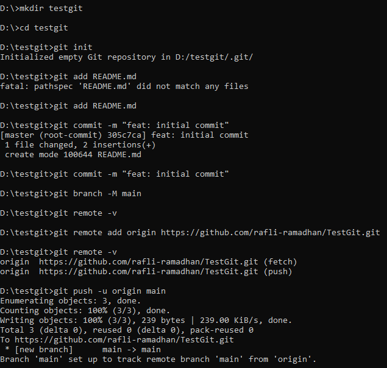

# Git Command

## Contoh command untuk membuat git repository di local

Langkah pertama, buat repository di github.com. Lalu jalankan command berikut.

```
git init                                 // untuk inisiasi repository git
git add README.md                        // pastikan sudah ada file README.md
git commit -m "first commit"             // untuk menambahkan perubahan code beserta message-nya
git branch -M main                       // untuk membuat branch master baru atau memperbaruhi nama branch master menjadi main
git remote add origin link_repository    // untuk menambahkan remote repository dari github.com
git push -u origin main                  // untuk mengirim perubahan code ke remote repository dan branch yang dituju
```

Contoh ekseskusi command di atas.

<figure><figcaption></figcaption></figure>

## Contoh command untuk menambahkan remote repository di local project

Asumsikan di suatu folder sudah ada beberapa file kodingan. Kemudian jalankan command berikut.

```
git remote add origin https://github.com/rafli-ramadhan/TestGit.git
git branch -M main
git push -u origin main
```

Command -u pada git push -u origin main digunakan untuk set upstream remote dan branch yaitu origin dan main. Selanjutnya jika command git pull dan git push di jalankan, maka akan otomatis melakukan pull dan push pada remote dan branch yang di set di awal yaitu origin dan main.

<figure><figcaption></figcaption></figure>

Referensi:


