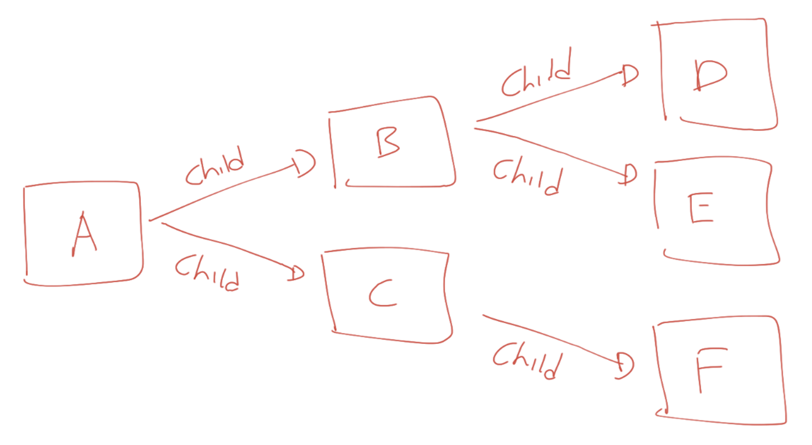

# Context With Value

Context bisa diterapkan parent dan chlid, 1 parent bisa punya banyak child, tapi 1 child hanya bisa punya 1 parent dengan menggunakan Context **WithValue**.

<figure><figcaption><p>Sumber gambar : dokumen bootcamp PT Phincon</p></figcaption></figure>

Saat dilakukan pembatalan context A, maka semua child dan sub child dari context A akan ikut dibatalkan. Jika kita membatalkan context B, hanya context B dan semua child dan sub child nya yang dibatalkan, context A tidak akan ikut dibatalkan.

Jika kita menyisipkan data ke dalam context A, semua child dan sub child nya bisa mengakses data tersebut. Jika kita menyisipkan data di context B, hanya context B dan semua child dan sub child nya yang dapat mengakses data dari context B.

Context merupakan object yang Immutable, artinya setelah Context dibuat tidak bisa diubah lagi. Ketika kita menambahkan value ke dalam context, atau menambahkan pengaturan timeout dan yang lainnya, secara otomatis akan membentuk child context baru, bukan merubah context tersebut.

## Contoh code context WithValue dengan value string

```go
package main

import (
	"context"
	"fmt"
)

func main() {
	ctxA := context.Background()
	// clild A
	ctxB := context.WithValue(ctxA, "keyB", "member_01")
	ctxC := context.WithValue(ctxA, "keyC", "member_02")

	fmt.Println(ctxB.Value("keyB")) // member_01
	fmt.Println(ctxB.Value("keyC")) // nil

	fmt.Println(ctxC.Value("keyC")) // member_02
	fmt.Println(ctxC.Value("keyB")) // nil
	// child B
	ctxD := context.WithValue(ctxB, "keyD", "member_03")
	fmt.Println(ctxD.Value("keyB")) // member_01
	fmt.Println(ctxD.Value("keyC")) // nil, karena bukan parent-nya
	fmt.Println(ctxD.Value("keyD")) // member_03
}

```

```
member_01
<nil>
member_02
<nil>
member_01
<nil>
member_03
```

## Contoh code context WithValue dengan value map

```go
package main

import(
    "context"
    "fmt"
)

func main() {
    value := map[string]string{
        "1": "one",
        "2": "two",
    }
    background := context.Background()
    child := context.WithValue(background, "value", value)
    todo := context.TODO()

    fmt.Println(background)
    fmt.Println(child)
    fmt.Println(child.Value("value"))
    fmt.Println(todo)
}
```

```
context.Background
context.Background.WithValue(type string, val <not Stringer>)
map[1:one 2:two]
context.TODO
```
