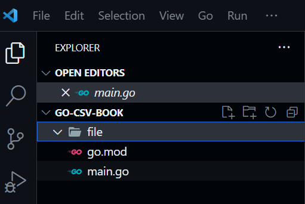

# Go dan CSV

Berikut adalah contoh code penggunaan package "encoding/csv" untuk generate file csv melalui kode golang dan menampilkan isi dari file csv di terminal. Struktur dari folder golang kurang lebih seperti ini.

<figure><figcaption></figcaption></figure>


```go
package main

import(
	"encoding/csv"
	"fmt"
	"log"
	"os"
	"math/rand"
	"strconv"
)

type bookStruct struct {
	name string
	quantity int
	location string
}

func main() {
	var booksName = []string{"Altera", "Dicoding", "Glints", "Progate", "Sanbercode"}
	var location = []string{"Jakarta", "Bandung", "Yogyakarta", "Semarang", "Malang"}
	var booksData []bookStruct
	for _, v := range booksName {
		booksData = append(booksData, bookStruct{
			name: v,
			quantity: rand.Intn(100-20)+20,
			location: location[rand.Intn(5)],
		})
		// fmt.Println(booksData[i])
	}

	csvfile, err := os.Create("file/bookstore.csv")
	if err != nil {
		log.Panicln("Error create data", err)
	}

	defer func() {
		if err := csvfile.Close(); err != nil {
			log.Panicln("Error closing file", err)
		}
	}()

	csvwriter := csv.NewWriter(csvfile)
	defer csvwriter.Flush()

	// WriteData(booksData, csvwriter)
	WriteAllData(booksData, csvwriter)

	csvfile2, err := os.Open("file/bookstore.csv")
	if err != nil {
		log.Panicln("Error open data", err)
	}
	csvreader := csv.NewReader(csvfile2)
	// ReadData(csvreader)
	// ReadData(csvreader)
	// ReadData(csvreader)
	ReadAllData(csvreader)
}

func WriteData(booksData []bookStruct, csvwriter *csv.Writer) {
	for _, v := range booksData {
		var temp = []string{v.name, strconv.Itoa(v.quantity), v.location}
		if err := csvwriter.Write(temp); err != nil {
			log.Fatalln("Error writing data", err)
		}
	}
}

func WriteAllData(booksData []bookStruct, csvwriter *csv.Writer) {
	var dataTempSlice [][]string
	for _, v := range booksData {
		var temp = []string{v.name, strconv.Itoa(v.quantity), v.location}
		dataTempSlice = append(dataTempSlice, temp)
	}
	if err := csvwriter.WriteAll(dataTempSlice); err != nil {
		log.Fatalln("Error writing data", err)
	}
}

func ReadData(csvreader *csv.Reader) {
	if record, err := csvreader.Read(); err != nil {
		fmt.Println(record)
	} else{
		log.Fatalln("Error read", err)
	}
}

func ReadAllData(csvreader *csv.Reader) {
	if booksDataSlice, err := csvreader.ReadAll(); err != nil {
		log.Fatalln("Error cant read data from csv")
	} else{
		for _, v := range(booksDataSlice) {
			fmt.Println("Name of books :", v[0])
			fmt.Println("Books of quantity :", v[1])
			fmt.Println("Location :", v[2])
			fmt.Println()
		}
	}
}
```


```
Name of books : Altera
Books of quantity : 42
Location : Malang

Name of books : Dicoding
Books of quantity : 57
Location : Semarang

Name of books : Glints
Books of quantity : 73
Location : Semarang

Name of books : Progate
Books of quantity : 25
Location : Yogyakarta

Name of books : Sanbercode
Books of quantity : 72
Location : Malang
```

File csv akan ter-generate di path yang sudah di definisikan di code.

<figure><figcaption></figcaption></figure>
