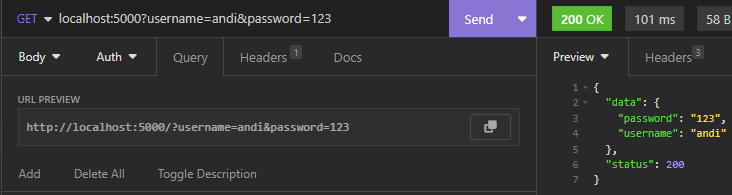

# Get Query Parameter

Untuk get query parameter bisa menggunakan method GetQuery() seperti _code_ dibawah ini.

```go
package main

import (
	"net/http"
	"github.com/gin-gonic/gin"
)

func main() {
	r := gin.Default()
	r.GET("/", Get)
	r.Run(":5000")
}

func Get(ctx *gin.Context) {
	username, _ := ctx.GetQuery("username")
	password, _ := ctx.GetQuery("password")
	
	ctx.JSON(200, gin.H{
		"status": http.StatusOK,
		"data":   map[string]interface{}{
			"username": username,
			"password": password,
		},
	})
}

```

<figure><figcaption></figcaption></figure>

atau bisa juga menggunakan method ShouldBind() seperti _code_ dibawah ini.

```go
package main

import (
	"net/http"
	"github.com/gin-gonic/gin"
)

func main() {
	r := gin.Default()
	r.GET("/", Get)
	r.Run(":5000")
}

type User struct {
	UserName string `form:"username"`
	Password string `form:"password"`
}
func Get(ctx *gin.Context) {
	var user User
	if err := ctx.ShouldBind(&user); err != nil {
		ctx.JSON(404, gin.H{
			"status":  http.StatusBadRequest,
			"message": err,
		})
	} else {
		ctx.JSON(200, gin.H{
			"status": http.StatusOK,
			"data":   user,
		})
	}
}

```

<figure><figcaption></figcaption></figure>
