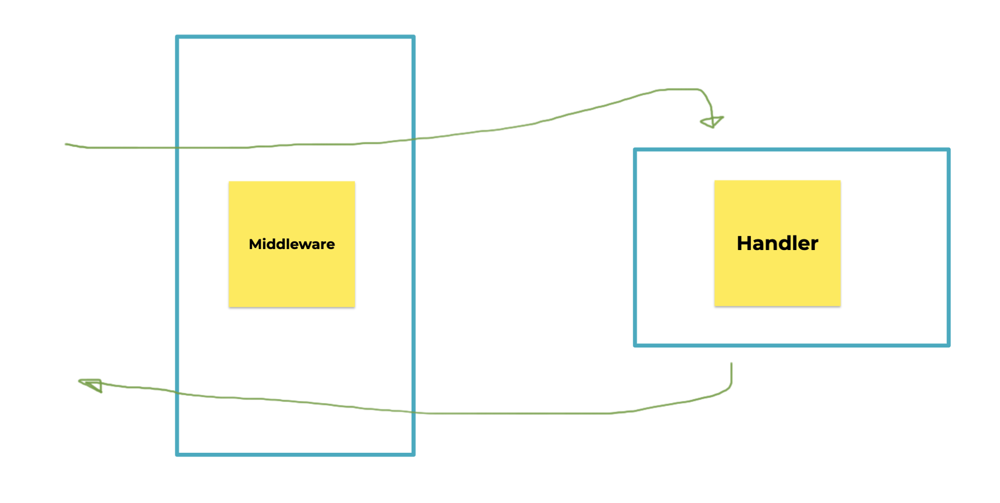

# Konsep Middleware

Middleware merupakan sebuah fitur dimana kita bisa menambahkan kode sebelum dan setelah sebuah service di eksekusi. Dalam REST API contoh service seperti handler.

<figure><figcaption>
<a href="https://docs.google.com/presentation/d/1h_8nk-Ani4SykMq5lhgubzdtAtZfzPce7FHUuAKlwmE/edit#slide=id.gd44b5e7ec0_0_810">https://docs.google.com/presentation/d/1h_8nk-Ani4SykMq5lhgubzdtAtZfzPce7FHUuAKlwmE/edit#slide=id.gd44b5e7ec0_0_810</a>
</figcaption></figure>
