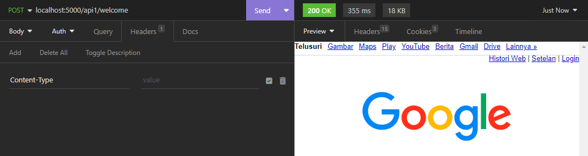

# Middleware

Untuk membuat middleware di Golang bisa menggunakan keyword Use seperti _code_ di bawah ini. Setiap group route juga dapat dibuat middleware yang berbeda.

```go
package main

import (
	"log"
	"net/http"
	"time"

	"github.com/gin-gonic/gin"
)

func main() {
	r := gin.Default()
	r.Use(Logging())
	r1 := r.Group("/api1")
	r2 := r.Group("/api2")
	r1.Use(ErrorMiddleware())
	r2.Use(LoggingTime())

	r1.GET("/welcome", Welcome)
	r1.POST("/welcome", Welcome)
	r2.GET("/welcome", Welcome)
	r2.POST("/welcome", Welcome)

	r.Run(":5000")
}

func Welcome(ctx *gin.Context) {
	log.Println("Welcome")
}

func ErrorMiddleware() gin.HandlerFunc {
	return func(ctx *gin.Context) {
		if ctx.GetHeader("Content-Type") != "" {
			ctx.Redirect(http.StatusMovedPermanently, "https://www.bing.com/")
		} else {
			ctx.Redirect(http.StatusMovedPermanently, "http://www.google.com/")
		}
		defer func() {
			err := recover()
			if err != nil {
				log.Println(err.(error))
			}
		}()
	}
}

func Logging() gin.HandlerFunc {
	return func(ctx *gin.Context) {
		status := ctx.Writer.Status()
		log.Println("middleware before", ctx.Request.Method, status)
		ctx.Next()
		log.Println("middleware after", ctx.Request.Method, status)
	}
}

func LoggingTime() gin.HandlerFunc {
	return func(ctx *gin.Context) {
		start := time.Now()
		log.Println("start from", start)
		ctx.Next()
		log.Println("end at", time.Since(start).Seconds())
	}
}
```

<figure><figcaption></figcaption></figure>

<figure><figcaption></figcaption></figure>

Middleware juga bisa di set untuk 1 route tertentu seperti _code_ di bawah ini.

```go
package main

import (
	"log"
	"net/http"
	"time"

	"github.com/gin-gonic/gin"
)

func main() {
	r := gin.Default()
	r.Use(Logging())
	r1 := r.Group("/api1")
	r2 := r.Group("/api2")

	r1.GET("/welcome", ErrorMiddleware(), Welcome)
	r1.POST("/welcome", ErrorMiddleware(), Welcome)
	r2.GET("/welcome", LoggingTime(), Welcome)
	r2.POST("/welcome", LoggingTime(), Welcome)

	r.Run(":5000")
}

func Welcome(ctx *gin.Context) {
	log.Println("Welcome")
}

func ErrorMiddleware() gin.HandlerFunc {
	return func(ctx *gin.Context) {
		if ctx.GetHeader("Content-Type") != "" {
			ctx.Redirect(http.StatusMovedPermanently, "https://www.bing.com/")
		} else {
			ctx.Redirect(http.StatusMovedPermanently, "http://www.google.com/")
		}
		defer func() {
			err := recover()
			if err != nil {
				log.Println(err.(error))
			}
		}()
	}
}

func Logging() gin.HandlerFunc {
	return func(ctx *gin.Context) {
		status := ctx.Writer.Status()
		log.Println("middleware before", ctx.Request.Method, status)
		ctx.Next()
		log.Println("middleware after", ctx.Request.Method, status)
	}
}

func LoggingTime() gin.HandlerFunc {
	return func(ctx *gin.Context) {
		start := time.Now()
		log.Println("start from", start)
		ctx.Next()
		log.Println("end at", time.Since(start).Seconds())
	}
}
```

Di Gin juga memungkinkan untuk membuat middleware sebelum dan setelah suatu handler. Sebagai contoh handler welcome memiliki 2 middleware yang dijalankan sebelum dan sesudah handler tersebut dijalankan.

```go
package main

import (
	"log"

	"github.com/gin-gonic/gin"
)

func main() {
	r := gin.Default()

	r.GET("/welcome", mid1, mid2, welcome, mid3, mid4)
	r.Run(":5000")
}

func mid1(ctx *gin.Context) {
	log.Println("mid1")
}

func mid2(ctx *gin.Context) {
	log.Println("mid2")
}

func welcome(ctx *gin.Context) {
	ctx.Writer.Write([]byte("success"))
	// ctx.Abort() -> menghentikan handler sampai disini
}

func mid3(ctx *gin.Context) {
	log.Println("mid3")
}

func mid4(ctx *gin.Context) {
	log.Println("mid4")
}
```
