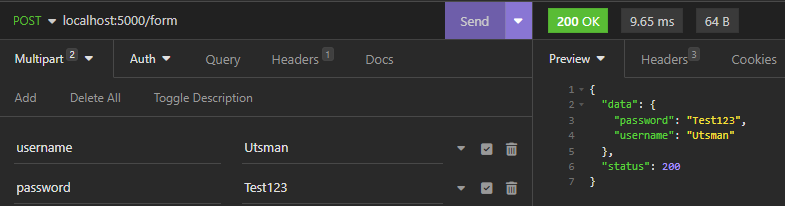

# Request Form

Untuk request form bisa digunakan method PostForm seperti _code_ dibawah ini

```go
package main

import (
	"net/http"

	"github.com/gin-gonic/gin"
)

func main() {
	r := gin.Default()
	r.POST("/form", PostForm)
	r.Run(":5000")
}

func PostForm(ctx *gin.Context) {
	username := ctx.PostForm("username")
	password := ctx.PostForm("password")

	ctx.JSON(200, gin.H{
		"status":	http.StatusOK,
		"data":		map[string]interface{}{
			"username": username,
			"password": password,	
		},
	})
}
```

<figure><figcaption></figcaption></figure>
