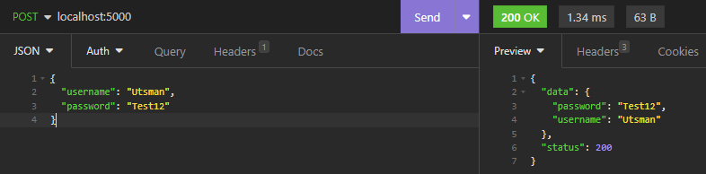

# Request JSON

Untuk request json bisa digunakan method ShouldBind seperti _code_ dibawah ini

```go
package main

import (
	"net/http"
	"github.com/gin-gonic/gin"
)

func main() {
	r := gin.Default()
	r.POST("/", PostJSON)
	r.Run(":5000")
}

type User struct {
	Username string
	Password string
}

func PostJSON(ctx *gin.Context) {
	var user User
	if err := ctx.ShouldBind(&user); err != nil {
		ctx.JSON(http.StatusBadRequest, gin.H{
			"status":  http.StatusBadRequest,
			"message": err,
		})
	} else {
		ctx.JSON(http.StatusOK, gin.H{
			"status": 	http.StatusOK,
			"data":		map[string]interface{}{
				"username": user.Username,
				"password": user.Password,	
			},
		})
	}
}
```

<figure><figcaption></figcaption></figure>

Untuk request dengan tipe array JSON perlu tipe data slice sebagai penampungnya.

```go
package main

import (
	"net/http"
	"github.com/gin-gonic/gin"
)

func main() {
	r := gin.Default()
	r.POST("/", PostJSON)
	r.Run(":5000")
}

type User struct {
	Username string
	Password string
}

func PostJSON(ctx *gin.Context) {
	var user []User
	if err := ctx.ShouldBind(&user); err != nil {
		ctx.JSON(http.StatusBadRequest, gin.H{
			"status":  http.StatusBadRequest,
			"message": err,
		})
	} else {
		ctx.JSON(http.StatusOK, gin.H{
			"status": 	http.StatusOK,
			"data":		user,
		})
	}
}
```

<figure><figcaption></figcaption></figure>
