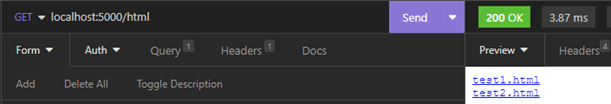
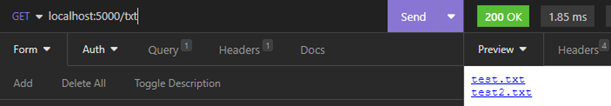
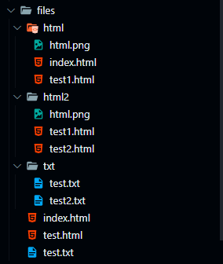

# Serve File

Kegunaan file server adalah untuk menampilkan suatu file yang ada dalam satu direktori yang sama dengan aplikasi.

## Contoh _code_ penggunaan file server

```go
package main

import (
	"fmt"
	"net/http"
)

func main() {
	mux := http.NewServeMux()
	// menampilkan file berdasarkan direktori (index.html yang utama)
	fs1 := http.FileServer(http.Dir("files/html"))
	fs2 := http.FileServer(http.Dir("files/html2"))
	fs3 := http.FileServer(http.Dir("files/txt"))

	mux.Handle("/", fs1)
	// jika didepan / ada tambahan kata, harus dihapus dengan http.StripPrefix
	mux.Handle("/html", http.StripPrefix("/html", fs2))
	mux.Handle("/txt", http.StripPrefix("/txt", fs3))

	server := http.Server{
		Addr:    "localhost:5000",
		Handler: mux,
	}

	fmt.Println("Server running on", server.Addr)
	err := server.ListenAndServe()
	if err != nil {
		panic(err)
	}
}
```

<figure><figcaption></figcaption></figure>

<figure><figcaption></figcaption></figure>

<figure><figcaption></figcaption></figure>

<figure><figcaption></figcaption></figure>

## Contoh _code_ penggunaan serve file

```go
package main

import (
	"fmt"
	"net/http"
)

func main() {
	mux := http.NewServeMux()

	mux.HandleFunc("/html1", func(w http.ResponseWriter, r *http.Request) {
		http.ServeFile(w, r, "./files/index.html")
	})
	mux.HandleFunc("/html2", func(w http.ResponseWriter, r *http.Request) {
		http.ServeFile(w, r, "./files/html/index.html")
		http.ServeFile(w, r, "./files/html/test2.html") // tidak akan ditampilkan
	})
	mux.HandleFunc("/txt", func(w http.ResponseWriter, r *http.Request) {
		http.ServeFile(w, r, "./files/txt/test.txt")
	})
	mux.HandleFunc("/jpg", func(w http.ResponseWriter, r *http.Request) {
		http.ServeFile(w, r, "./files/jpg/cat.jpg")
	})
	mux.HandleFunc("/json", func(w http.ResponseWriter, r *http.Request) {
		http.ServeFile(w, r, "./files/json/test.json")
	})

	server := http.Server{
		Addr:    "localhost:5000",
		Handler: mux,
	}

	fmt.Println("Server running on", server.Addr)
	err := server.ListenAndServe()
	if err != nil {
		panic(err)
	}
}
```

Struktur file dalam direktori ./file, ./file/html dan ./file/txt.

<figure><figcaption></figcaption></figure>
