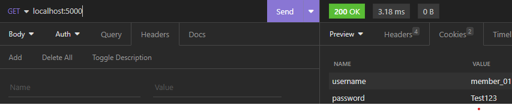

# Get dan Set Cookie

Cookie merupakan data yang dibuat di server dan dikirimkan ke web browser dan sengaja agar disimpan di web browser. Penerapan semisal untuk menyimpan data user saat login.

<pre class="language-go"><code class="lang-go">package main

import (
	"fmt"
<strong>	"net/http"
</strong>)

func main() {
	mux := http.NewServeMux()
	mux.HandleFunc("/", func(w http.ResponseWriter, r *http.Request) {
		// request cookie
		key = r.Cookie("key")
		fmt.Println(key)
		// set cookie in response
		cookie1 := new(http.Cookie)
		cookie1.Name = "username"
		cookie1.Value = "member_01"
		cookie2 := new(http.Cookie)
		cookie2.Name = "password"
		cookie2.Value = "Test123"
		http.SetCookie(w, cookie1)
		http.SetCookie(w, cookie2)
	})

	server := http.Server{
		Addr: 	"localhost:5000",
		Handler: mux,
	}

	fmt.Println("Server running on", server.Addr)
	err := server.ListenAndServe()
	if err != nil {
		panic(err)
	}
}
</code></pre>

<figure><figcaption></figcaption></figure>
