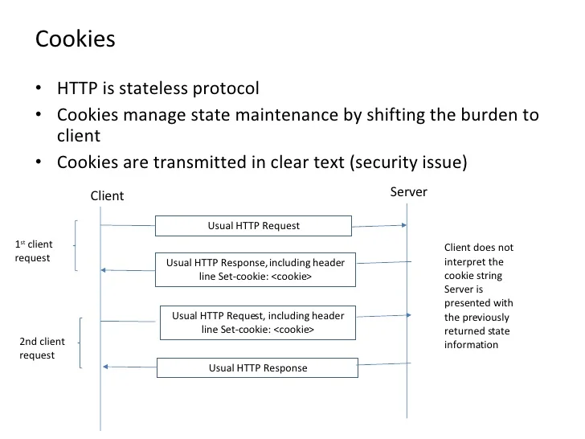

# Pengenalan HTTP

Istilah-istilah penting dalam HTTP

* Web : bagian dari internet yang terdiri dari pages dan bisa diakses melalui web browser.
* Client : Sisi user (front end atau Postman)
* Server : Sisi back end
* HTTP :  Protokol untuk komunikasi data dari client (browser) ke server (backend).
* Header : Informasi tambahan terkait request atau response saat hit suatu service endpoint
* Request : Data yang dikirim dari client ke server
* Response : Balasan yang dikirim dari server ke client&#x20;
* Cookie : Data yang dikirim dari server ke client dan disimpan di sisi client yang dipakai saat request selanjutnya.
* Middleware : Baris kode yang dijalankan sebelum dan sesudah suatu service di jalankan
* Status code : Informasi untuk mengindikasikan apakah request sukses atau tidak sukses beserta alasannya (Contoh : HTTP Not Found).
* HTTP Request Method : Method yang dilakukan saat mengirim request ke suatu service (Contoh HTTP request method -> GET, POST, PUT, PATCH, DELETE, OPTION)
* Path : Alamat tujuan dari suatu service-> contoh : localhost:5000/index.html

<figure><figcaption>
<a href="https://pijaeducation.com/wp-content/uploads/2020/03/HTTP_status_codes.jpg">https://pijaeducation.com/wp-content/uploads/2020/03/HTTP_status_codes.jpg</a>
</figcaption></figure>

## Stateless

HTTP merupakan stateless antara client dan server yang artinya server tidak akan menyimpan data apapun untuk mengingat setiap request dari client. Tujuannya supaya mudah melakukan scalability di sisi server. Lantas bagaimana caranya agar server bisa mengingat sebuah client? Misal ketika kita sudah login di website, server otomatis harus tahu jika client tersebut sudah login, sehingga request selanjutnya, tidak perlu diminta untuk login lagi. Solusinya bisa dengan memanfaatkan Cookie.

<figure><figcaption>
<a href="https://image.slidesharecdn.com/httpbasics-1207412539273264-9/95/http-basics-11-728.jpg?cb=1207387322">https://image.slidesharecdn.com/httpbasics-1207412539273264-9/95/http-basics-11-728.jpg?cb=1207387322</a>
</figcaption></figure>
