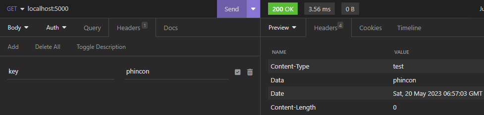

# Get dan Set Header

Header merupakan suatu informasi tambahan terkait request yang dikirim oleh client atau response dari server. Untuk menangkap request header yang dikirim oleh client, kita bisa mengambilnya di Request. Header mirip seperti query parameter yang isinya berupa map\[string]\[]string. Berbeda dengan query parameter yang case sensitive (huruf besar kecil berpengaruh), header tidaklah case sensitive.

```go
package main

import (
	"fmt"
	"net/http"
)

func main() {
	mux := http.NewServeMux()
	mux.HandleFunc("/", func(w http.ResponseWriter, r *http.Request) {
		// get header from request
		key := r.Header.Get("key")
		// add header in request
		r.Header.Add("username", "test")
		// add new header
		w.Header().Add("Data", key)
		// update existing header
		w.Header().Set("Content-Type", "test")
		// get header from response
		contentType := w.Header().Get("Content-Type")
		fmt.Println(contentType)
		w.WriteHeader(200)
	})

	server := http.Server{
		Addr: 	"localhost:5000",
		Handler: mux,
	}

	fmt.Println("Server running on", server.Addr)
	err := server.ListenAndServe()
	if err != nil {
		panic(err)
	}
}
```

<figure><figcaption></figcaption></figure>
