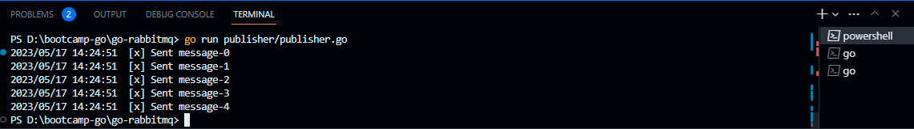

# Routing

Routing merupakan deklarasi path pada HTTP server. Untuk membuat HTTP routing di native golang diperlukan request Method. Request sendiri merupakan informasi yang dikirim oleh client. Request yang berguna untuk routing adalah request method yang digunakan untuk memperoleh HTTP method yang dikirim oleh client. Berikut adalah contoh _code_ untuk routing di native golang.

```go
package main

import (
	"fmt"
	"net/http"
)

func main() {
	mux := http.NewServeMux()

	// request -> data type: struct
	var handlerMain http.HandlerFunc = func(w http.ResponseWriter, r *http.Request) {
		if r.Method == http.MethodGet {
			fmt.Fprintf(w, r.Method)
		} else if r.Method == http.MethodPost {
			fmt.Fprintf(w, r.Method)
		} else if r.Method == http.MethodPatch {
			fmt.Fprintf(w, r.Method)
		} else if r.Method == http.MethodDelete {
			fmt.Fprintf(w, r.Method)
		}
	}
	mux.HandleFunc("/", handlerMain)

	fmt.Println("Server running")
	server := http.Server{
		Addr:   "localhost:5000",
		Handler: mux,
	}

	err := server.ListenAndServe()
	if err != nil{
		panic(err.Error())
	}
}
```

<figure><figcaption></figcaption></figure>

<figure><figcaption></figcaption></figure>
