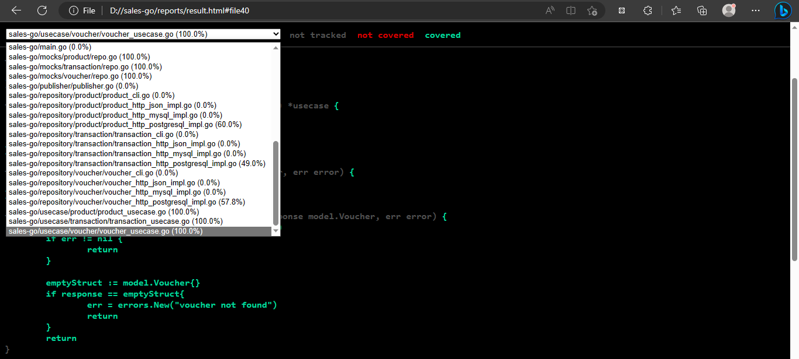

# Generate Coverage Unit Testing dalam Bentuk HTML

Coverage unit testing merupakan berapa persen suatu unit test yang telah dibuat di suatu aplikasi. Untuk mengetahui coverage unit testing salah satunya bisa dengan cara berikut.

1. Buat folder baru semisal dengan nama reports pada aplikasi Golang yang ingin di generate coverage unit testing-nya.
2. Jalankan command berikut untuk memperoleh file result.out.

```bash
go test ./... -v -coverpkg=./... -coverprofile=reports/result.out
```

3. Generate result.html dengam command berikut.

```bash
go tool cover -html reports/result.out -o reports/result.html
```

4. File result.html dan result.out akan otomatis ter-generate di folder reports.

<figure><figcaption></figcaption></figure>

5. Buka file result.html di browser, maka bisa dilihat coverage unit testing setiap file golang di aplikasi saat ini.

<figure><figcaption></figcaption></figure>
