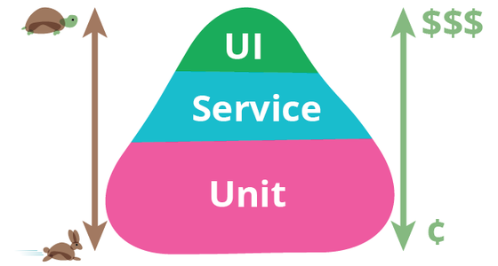

# Pengenalan Testing Perangkat Lunak

## Testing pada Perangkat Lunak (Software Testing)

Software testing berfungsi untuk memastikan kualitas kode dan aplikasi berjalan dengan baik.

## Test Pyramid

Unit testing merupakan jenis test yang dibuat untuk menguji setiap unit komponen dalam suatu program seperti function. Testing unit lebih murah karena scope-nya lebih kecil daripada UI testing dan bisa untuk menguji sebuah function atau method.

UI Test menjadi testing yang membutukan banyak biaya karena :

1. Mencakup FE web, app dan backend (high level architecture)
2. Banyak service yang perlu di test.

Berikut adalah test pyramid dari software testing.

<figure><figcaption>
Sumber gambar : <a href="https://docs.google.com/presentation/u/2/?usp=slides_web">https://docs.google.com/presentation/u/2/?usp=slides_web</a>
</figcaption></figure>

## SIT

SIT (System Integration Testing) merupakan testing yang dilakukan oleh QA team.&#x20;

## UAT

UAT (User Acceptance Testing) merupakan testing yang dilakukan oleh user dengan env hampir mirip dengan production, namun dengan test case yang tidak sebanyak SIT.

Reference:


