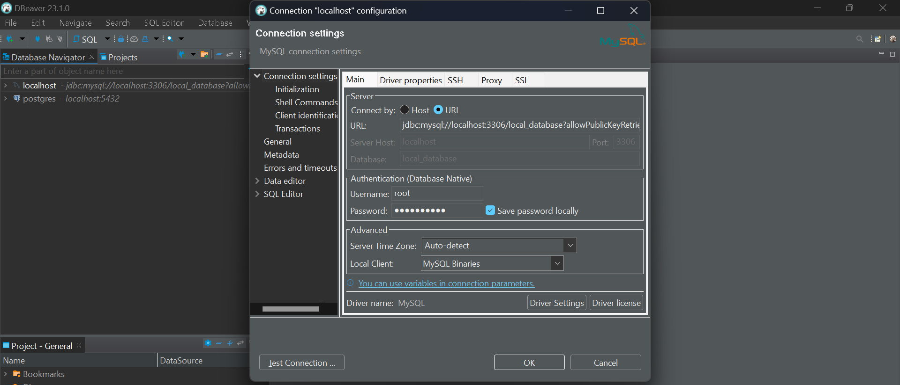

# Instalasi MySQL dengan Docker Desktop

Jalankan docker desktop, lalu buka tab search dan cari image MySQL.

<figure><figcaption></figcaption></figure>

Selanjutnya pull image MySQL dan tunggu sampai proses download selesai. Setelah proses download selesai, image MySQL akan otomatis muncul di tab Images.

<figure><figcaption></figcaption></figure>

Selanjutnya jalankan Images tersebut dengan setting sebagai berikut.

<figure><figcaption></figcaption></figure>

<figure><figcaption></figcaption></figure>

Lalu klik run dan cek tab container untuk memastikan container MySQL sudah berjalan.

<figure><figcaption></figcaption></figure>

Gunakan GUI seperti DBeaver untuk cek koneksi MySQL. Untuk URL dapat diisi dengan format berikut. Nama database diisi dengan nama database yang sama saat mengisi optional setting env saat ingin running image MySQL.

```
jdbc:mysql://localhost:3306/nama_database?allowPublicKeyRetrieval=true
```

<figure><figcaption></figcaption></figure>
