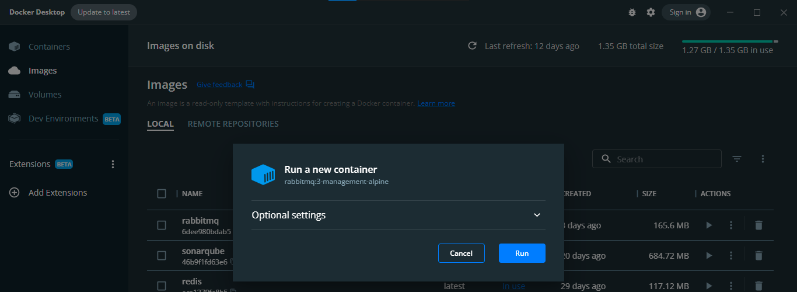
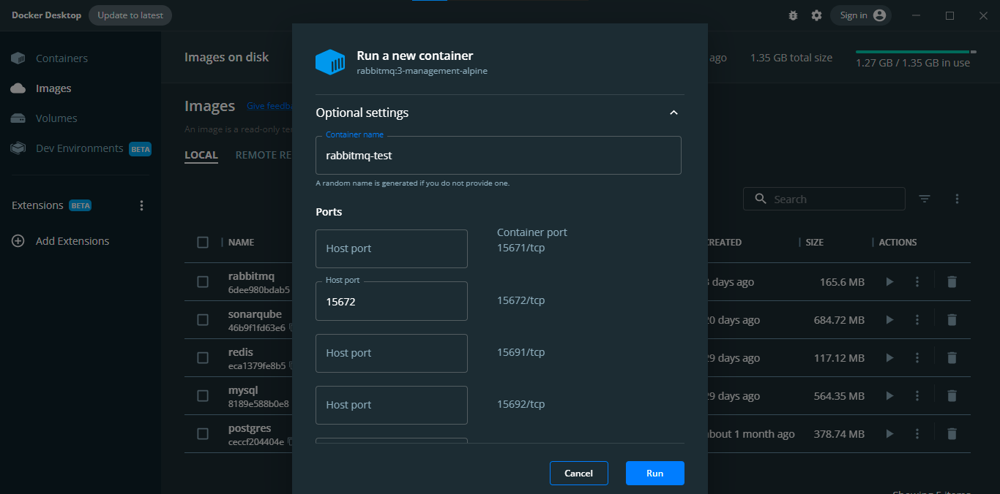
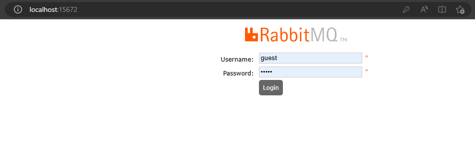
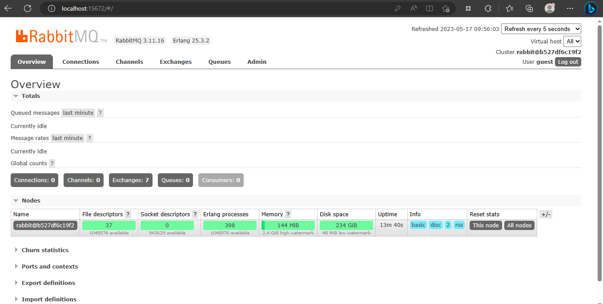

# Instalasi RabbitMQ dengan Docker

Instalasi rabbitmq di docker dapat dicermati pada link berikut [https://hub.docker.com/\_/rabbitmq/](https://hub.docker.com/\_/rabbitmq/). Persyaratan untuk instalasi RabbitMQ adalah harus sudah menginstall docker atau docker dekstop (untuk Windows).

1. Buka aplikasi docker dekstop dan tunggu sampai docker benar-benar berjalan.

<figure><figcaption><p>Tampilan docker dekstop</p></figcaption></figure>

1. Buka CMD/ powershell / bash dan copy paste command berikut dan tunggu sampai proses download selesai.

```
docker pull rabbitmq:3-management-alpine
```

<figure><figcaption></figcaption></figure>

3. RabbitMQ akan otomatis muncul di tab image di docker desktop. Untuk menjalankannya bisa dengan klik tanda run di sebelah kanan. Isi port 5672 dan 15672 dengan nilai yang sama. Port 5672 digunakan sebagai server RabbitMQ, sementara port 15672 digunakan sebagai UI-nya.

<figure><figcaption></figcaption></figure>

<figure><figcaption></figcaption></figure>

4. Setelah container RabbitMQ yang telah dibuat telah berjalan, buka localhost:15672 di web browser dan masukkan username "guest" dan password "guest".

<figure><figcaption></figcaption></figure>

<figure><figcaption></figcaption></figure>
