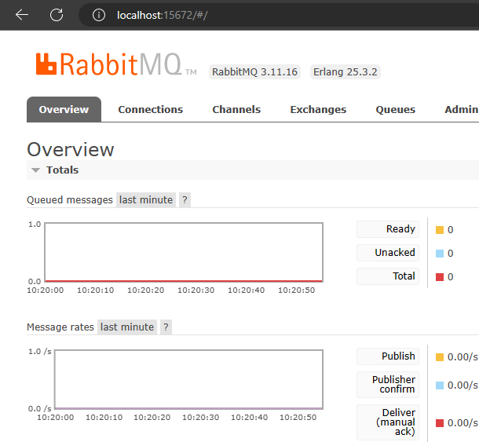
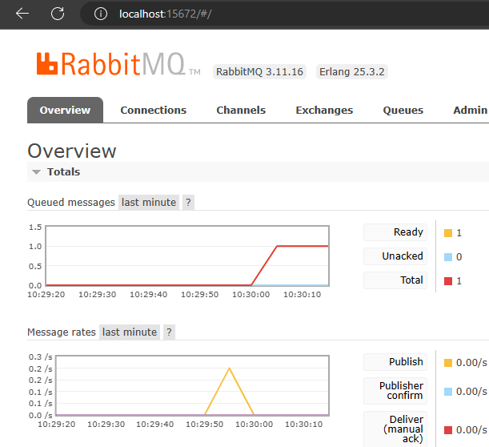
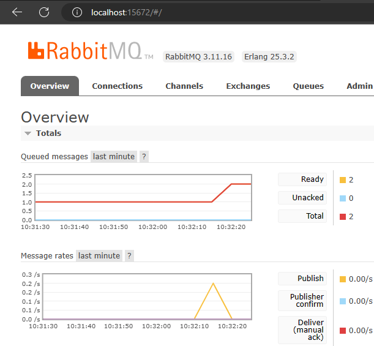
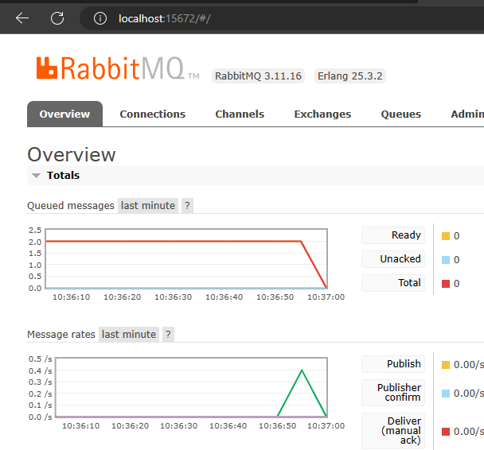

# Publisher dan Consumer

## Konsep

Konsep publisher (sender) dan sender (receiver) dapat diamati pada gambar berikut. Publisher dan Consumer bisa diasumsikan file.go yang berbeda, sementara blok merah merupakan queue yang merupakan data yang dikirim mengikuti aturan FIFO (first in first out).

<figure><figcaption><p><a href="https://www.rabbitmq.com/tutorials/tutorial-one-go.html">https://www.rabbitmq.com/tutorials/tutorial-one-go.html</a></p></figcaption></figure>

## Tutorial

* Buat file misal sender.go di folder sender dan _copy code_ pada link di bawah ini. Data yang dikirim dari sender.go adalah data dengan tipe data byte. Data tersebut bisa dilihat pada variabel body.



* Buat file misal receiver.go di folder receiver dan _copy code_ pada link berikut



* Struktur folder dan file yang dibuat bisa seperti di bawah ini.

<figure><figcaption></figcaption></figure>

* Sebelum data dikirim dari sender, tampilan UI RabbitMQ akan seperti ini

<figure><figcaption></figcaption></figure>

* Selanjutnya coba jalankan sender.go dengan command berikut.

```
go run sender/sender.go
```

* Grafik pada UI RabbitMQ akan naik menjadi 1, artinya ada 1 queue yang masuk namun belum ada penerima.

<figure><figcaption></figcaption></figure>

&#x20;

* Selanjutnya jalankan lagi go run sender.sender.go, maka grafiknya akan naik menjadi 2, artinya ada 2 queue yang masuk.

<figure><figcaption></figcaption></figure>

* Selanjutnya coba jalankan receiver dengan command berikut.

```
go run receiver/receiver.go
```

* Receiver akan menerima semua data queue yang telah dikirim dari sender. Sehingga grafik di UI RabbitMQ akan menurun menjadi 0, artinya pesan sudah di terima oleh receiver.go. Log dari pesan juga akan ditampilkan di terminal.

<figure><figcaption></figcaption></figure>

<figure><figcaption></figcaption></figure>
