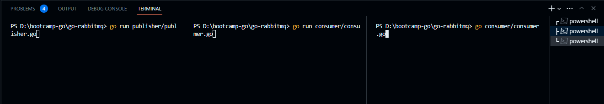
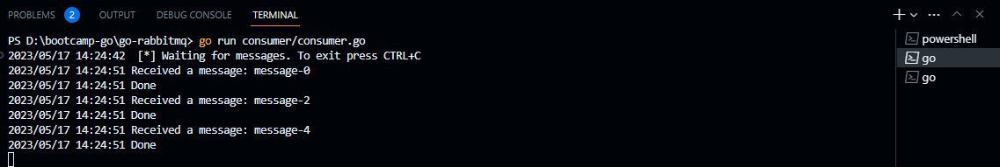
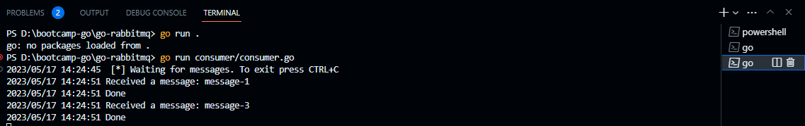

# Publisher dan Multi Consumer

## Konsep

<figure><figcaption><p><a href="https://www.rabbitmq.com/tutorials/tutorial-two-go.html">https://www.rabbitmq.com/tutorials/tutorial-two-go.html</a></p></figcaption></figure>

Ide utama yang dimiliki oleh RabbitMQ yakni publish/subscribe, publish subscribe berarti mengirimkan pesan ke beberapa consumer. Konsep pada gambar di atas mirip dengan bahasan sebelumnya, perbedaannya pada jumlah konsumer. Untuk membuat lebih dari satu consumer, bisa dengan menjalankan 1 _code_ consumer di beberapa terminal yang berbeda.

## Tutorial

* Copy code worker sebagai consumer (receiver) dari link di bawah ini di file consumer.go.&#x20;



* Copy code new\_task sebagai publisher (sender) dari link di bawah ini di file publisher.go



* Struktur folder akan tampak seperti di bawah ini.

<figure><figcaption></figcaption></figure>

* Buka 3 terminal (bisa CMD/powershell/git bash)
* Jalankan consumer.go (consumer / receiver) terlebih dahulu di terminal ke-1 dan terminal ke-2 menggunakan command di bawah ini, sehingga ada 2 consumer yang berjalan.

```
go run consumer/consumer.go
```

<figure><figcaption><p>Menjalankan publisher dan consumer di 3 terminal yang berbeda</p></figcaption></figure>

<figure><figcaption><p>Terminal publisher</p></figcaption></figure>

* Selanjutnya baru jalankan publisher.go (publisher / sender) dengan command di bawah ini di terminal ke-3.

```
go run publisher/publisher.go
```

* Amati juga log yang tampil di terminal kedua consumer seperti di bawah ini. Pesan dari publisher diterima oleh kedua consumer secara bergantian (disebut Round Robin).

<figure><figcaption><p>Terminal consumer 1</p></figcaption></figure>

<figure><figcaption><p>Terminal consumer 2</p></figcaption></figure>
