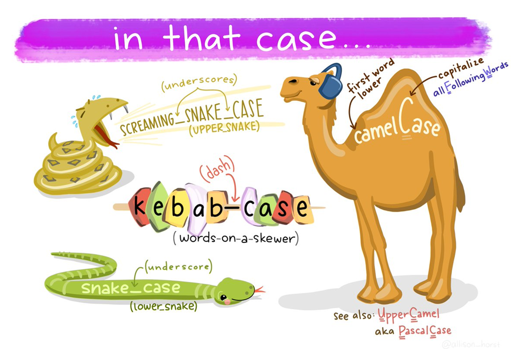

# Kebab Case, Camel Case, Snake Case & Pascal Case di Golang

* **Kebab case** biasa digunakan pada penamaan file seperti di bawah ini yang dapat dikenali dengan tanda "-" sebagai pemisah antar kata.

```
file-handler.go
```

```
user-repo.go
```

* **Camel case** biasa digunakan pada deklarasi variabel yang diawali dengan huruf kecil dan untuk kata berikutnya diawali dengan huruf besar serta antar kata tidak diberi spasi. Contohnya seperti di bawah ini.

```go
var userName string = "member_01"
```

* **Snake case** biasa digunakan di JSON yang dikenali dengan adanya "\_" sebagai pemisah antar kata. Contohnya seperti di bawahi ini.

```json
{
    "user_name": "member_01",
}
```

* **Pascal case** biasa digunakan pada parameter struct di Golang. Hampir mirip dengan camel case, bedanya diawali dengan huruf besar. Contohnya di bawah ini.

```go
type User struct {
    FullName string // pascal case
}
```

<figure><figcaption><p>Sumber gambar : <a href="https://th.bing.com/th/id/R.093fd2c8e3c4d081674948c6bac66d0d?rik=ynV9%2bStQelQ5Dg&#x26;riu=http%3a%2f%2fwww.visualdicas.com.br%2ftransfer%2fQuais-as-formas-mais-populares-para_EF9F%2fimage_3.png&#x26;ehk=BDI%2bgtXyFmF2%2bIpah563sAEFLCTg7ECBT7GyL%2fcrOuI%3d&#x26;risl=&#x26;pid=ImgRaw&#x26;r=0">https://th.bing.com/th/id/R.093fd2c8e3c4d081674948c6bac66d0d?rik=ynV9%2bStQelQ5Dg&#x26;riu=http%3a%2f%2fwww.visualdicas.com.br%2ftransfer%2fQuais-as-formas-mais-populares-para_EF9F%2fimage_3.png&#x26;ehk=BDI%2bgtXyFmF2%2bIpah563sAEFLCTg7ECBT7GyL%2fcrOuI%3d&#x26;risl=&#x26;pid=ImgRaw&#x26;r=0</a></p></figcaption></figure>
