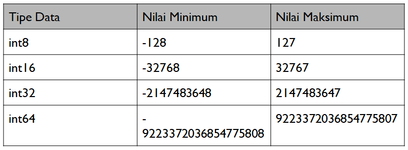

# Int & Uint (Unsigned Integer)

Default value dari tipe data integer adalah 0. Untuk Int8, Int16, Int32, Int64 perbedaannya terletak pada jumlah nilai minimal dan maksimal yang bisa ditampung. Selain itu, angka 8, 16, 32 dan 64 bisa disesuaikan dengan jumlah bit pada komputer yang digunakan.

<figure><figcaption></figcaption></figure>

Adapula uint (unsigned integer) yang digunakan untuk menampung value berupa integer positif.

<figure><figcaption></figcaption></figure>

```go
package main

import "fmt"

var num int

func main() {
    if num == 0 {
        fmt.Println("zero value")
    }
    num = -5
    fmt.Println(num)
    
    num2 := uint(num)
    fmt.Println(num2)
}
```

```
zero value
-5
18446744073709551611
```

## Int vs Int32 atau Int64

Int dan Int32 atau Int64 bukan tipe data yang sama. Tipe data int bergantung pada memori dari komputer yang digunakan. Tipe data int64 dapat dipilih jika memori bukan masalah utama dalam pengembangan aplikasi.

Untuk nilai maksimal dari int64 adalah 2 pangkat 63 - 1.

```
0111111111111111111111111111111111111111111111111111111111111111
```

Reference:




