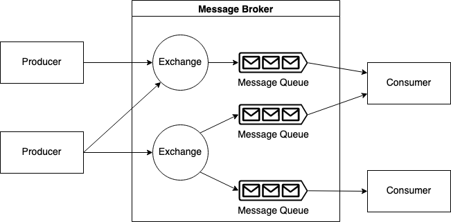

# Golang dan RabbitMQ

## Pengenalan Message Broker

* Message broker adalah perangkat lunak yang digunakan untuk **mengirimkan** dan **menerima** **pesan** antara **aplikasi** dan **sistem**. Dalam arsitektur mikro, message broker berfungsi sebagai penghubung antara layanan dan memastikan bahwa pesan terkirim dengan aman dan efisien.
* RabbitMQ merupakan message broker yang berfungsi untuk menerima dan meneruskan pesan. Message broker yang mengimplementasikan Advanced Message Queuing Prtocol (AMQP).
* Rabbit MQ memudahkan pengiriman pesan secara real-time dan dapat diintegrasikan dengan 11 bahasa pemrograman.
* Beberapa hal yang harus diperhatikan saat menggunakan message broker dengan efektif salah satunya yakni kita harus memastikan bahwa pesan yang dikirikan terhindar dari **message loss** atau **duplikasi informasi**.
* Fitur utama yang ditawarkan RabbitMQ yakni jaminan pengiriman pesan yang mana apabila consumer gagal dalam proses penerimaan pesan, pesan tidak akan hilang. Pesan yang gagal diproses oleh consumer akan di-queue ulang.
* Message broker menggunakan model publish-subsribe di mana publisher mengirim pesan ke topic atau channel, sedangkan subscriber menerima pesan dari topic atau channel. Message broker pada dasarnya bekerja sebagai mediator untuk memastikan bahwa pesan disampaikan ke subscriber yang tepat.

<figure><figcaption>
<a href="https://miro.medium.com/max/1302/0*p05ch77ERQOpj2GN.png">https://miro.medium.com/max/1302/0*p05ch77ERQOpj2GN.png</a>
</figcaption></figure>

<figure><figcaption>
Contoh software message broker
</figcaption></figure>
