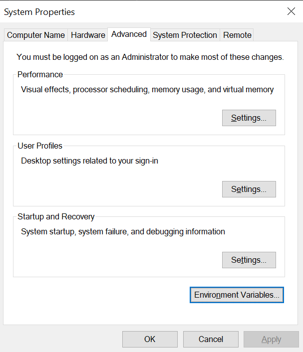
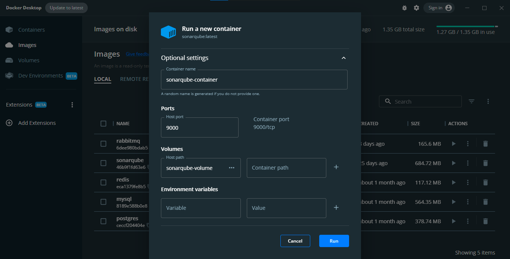
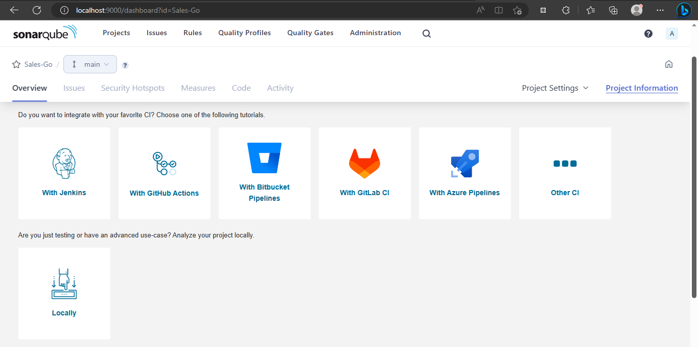
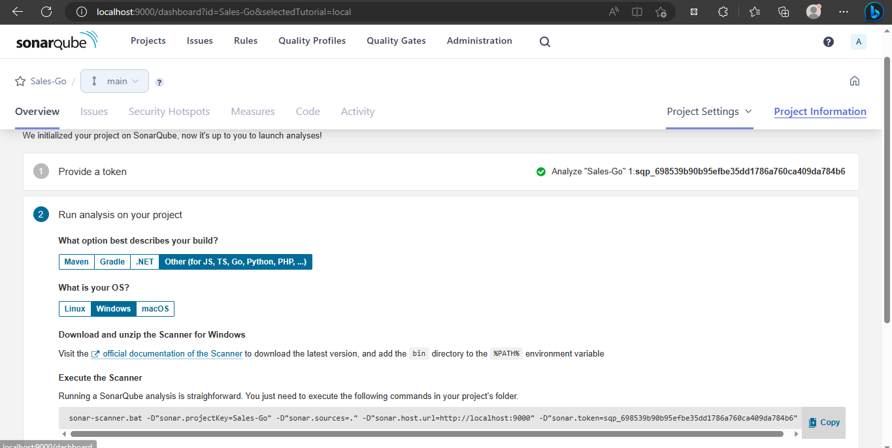
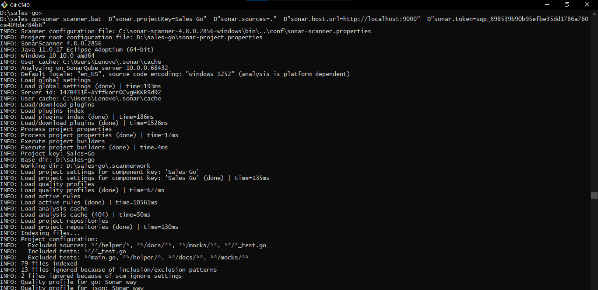
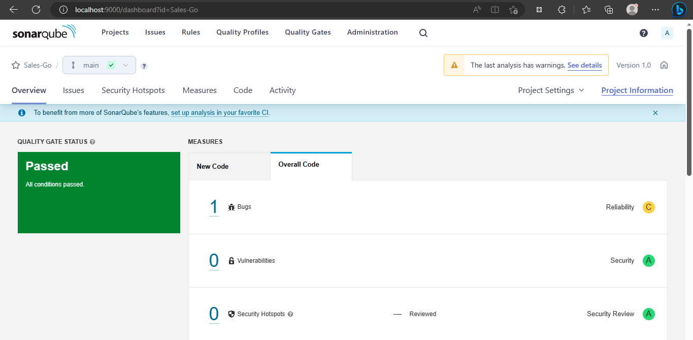
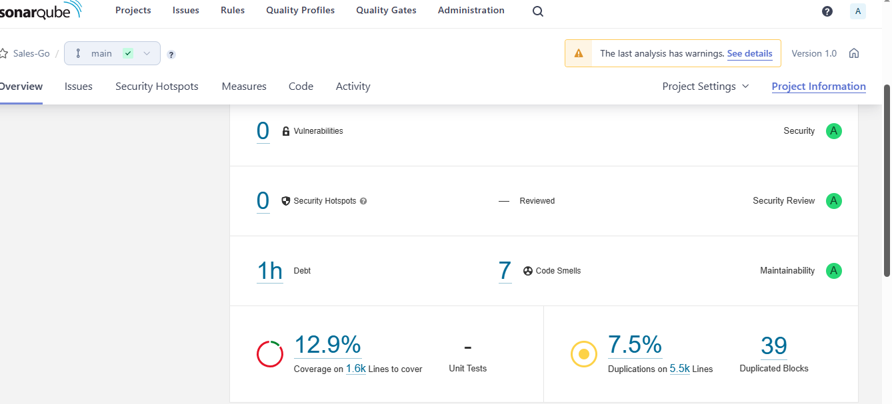
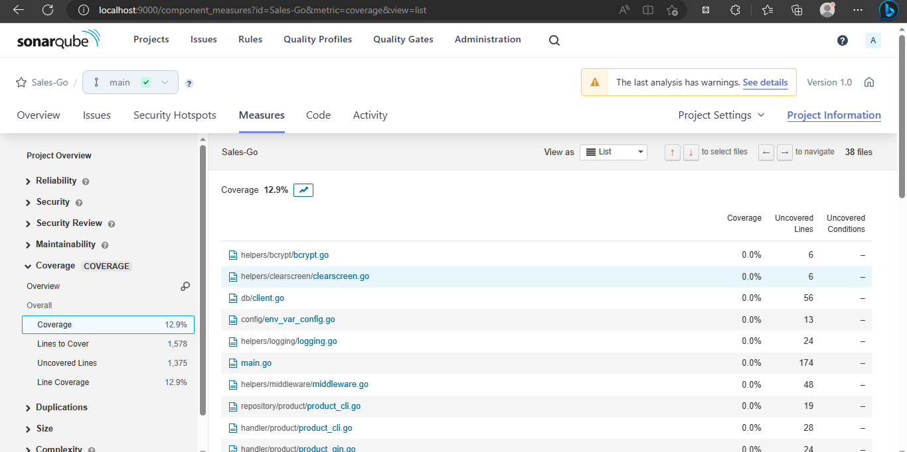

# Sonar Qube dan Sonar Scanner

Sonar qube merupakan software untuk memeriksa coverage dari unit testing, bug dan duplikasi code dari suatu aplikasi (Golang/Java/dsb). Untuk bisa pass di Sonar Quba coverage unit testing perlu di atas 80 % dan duplikasi harus dibawah 8%.

## Installasi Sonar Scanner

Sonar scanner digunakan untuk bisa menjalankan token yang diperoleh dari sonar qube di terminal bash (git bash/etc) untuk Windows OS. Cara instalasinya yaitu:

1. Download file sonar scanner ZIP pada link berikut [https://docs.sonarqube.org/latest/analyzing-source-code/scanners/sonarscanner/](https://docs.sonarqube.org/latest/analyzing-source-code/scanners/sonarscanner/)
2. Ekstrak file ZIP tersebut dan letakkan pada suatu folder.
3. Tambahkan file tersebut pada path di system variabel di system environment variabel. Untuk Windows OS dapat dengan mengikuti cara berikut.

<div>

<figure><figcaption></figcaption></figure>

 

<figure><figcaption></figcaption></figure>

 

<figure><figcaption></figcaption></figure>

 

<figure><figcaption></figcaption></figure>

</div>

4. Cek di terminal dengan command berikut untuk memastikan sonar-scanner sudah terinstall.

```bash
sonar-scanner.bat -h
```

<figure><figcaption></figcaption></figure>

## Installasi Sonar Qube dengan Docker

Instalasi sonar qube di docker dekstop dapat dilakukan dengan menjalankan command berikut di CMD/bash/powershell. Pastikan sebelum command tersebut dijalankan, docker sudah berjalan.

```
docker pull sonarqube
```

Jika menggunakan docker dektop, bisa langsung search sonar qube. Setelah itu klik pull, setelah proses instalasi selesai, sonar qube akan otomatis ada di tab images docker dekstop.

<figure><figcaption></figcaption></figure>

<figure><figcaption></figcaption></figure>

## Menjalankan Sonar Qube Image

Klik tombol run di sebelah kanan images.

<figure><figcaption></figcaption></figure>

Klik drop down optional settings dan set sonarqube dengan alamat port yaitu 9000. Selanjutnya klik run dan cek tab containers. Tunggu beberapa saat sampai sonar qube benar-benar sudah berjalan.

<figure><figcaption></figcaption></figure>

Setelah itu, cek localhost:9000 maka akan muncul tampilan berikut. Masukkan username dan password. Untuk pertama kali login user dan password-nya sama yaitu 'admin'. Selanjutnya klik log in.

<figure><figcaption></figcaption></figure>

## Membuat Project Baru di Sonar Qube

1. Untuk membuat project baru klik create project secara manual.

<figure><figcaption></figcaption></figure>

2. Pilih locally, untuk memiliki aplikasi di local computer yang ingin di cek coverage test-nya.

<figure><figcaption></figcaption></figure>

3. Ikuti langkah 1 dan 2 pada gambar berikut, pastikan pilih sesuai bahasa pemrograman dan OS yang digunakan. Setelah itu salin token yang diperoleh.

<figure><figcaption></figcaption></figure>

4. Buat sonnar-project.properties di dalam folder aplikasi Golang. File sonar-project.properties dapat seperti contoh berikut. Nama sonar.projectKey dan sonar.projectName harus sesuai dengan yang diisi di langkah 3.

<figure><figcaption></figcaption></figure>

```properties
sonar.projectKey=Sales-Go
sonar.projectName=Sales-Go

sonar.projectVersion=1.0
# source of program
sonar.sources=.
# source of program that will not be scanned by sonnar scanner
sonar.exclusions=**/helper/*,**/docs/**, **/mocks/**
sonar.ts.tslint.configPath=tslint.json
sonar.typescript.lcov.reportPaths=coverage/lcov.info

# testing needs config
sonar.test.inclusions=**/*_test.go
sonar.test.exclusions=**main.go, **/helper/*,**/docs/**, **/mocks/**
sonar.go.coverage.reportPaths=reports/result.out
```

5. Jalankan token yang diperoleh pada langkah 3 di folder aplikasi golang yang ingin di cek coverage test-nya.

<figure><figcaption></figcaption></figure>

6. Setelah command dari sonnar qube telah selesai dijalankan, tab overview di sonar qube akan otomatis berubah seperti di bawah ini.

<figure><figcaption></figcaption></figure>

7. Scroll ke bawah dan klik bagian angka di samping tanda %, maka akan diarahkan ke hamalan measurement coverage unit test masing-masing file.

<figure><figcaption></figcaption></figure>

<figure><figcaption></figcaption></figure>

Reference:






