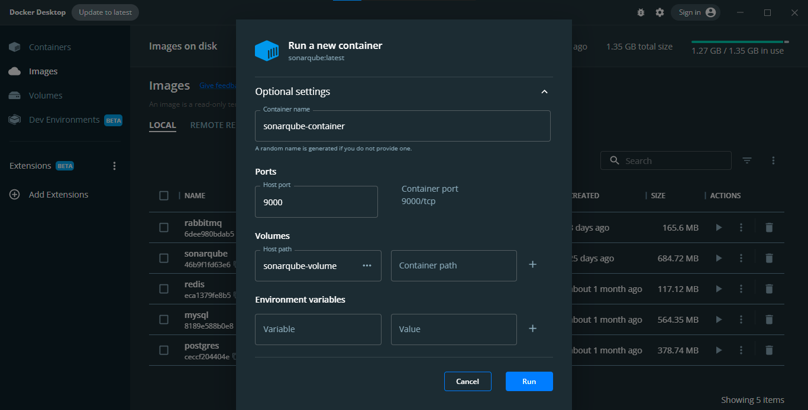
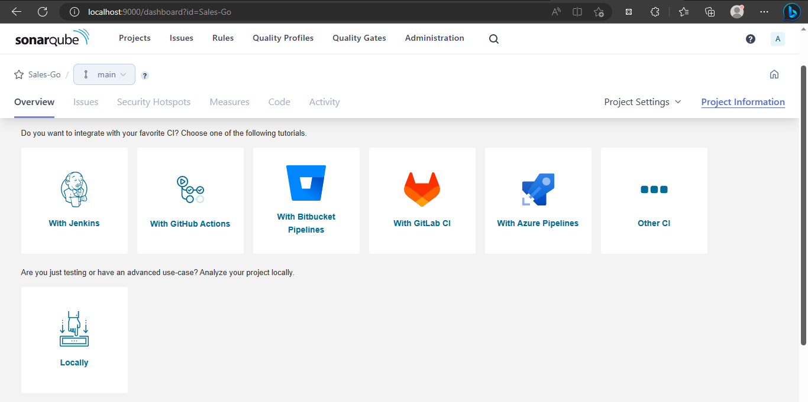
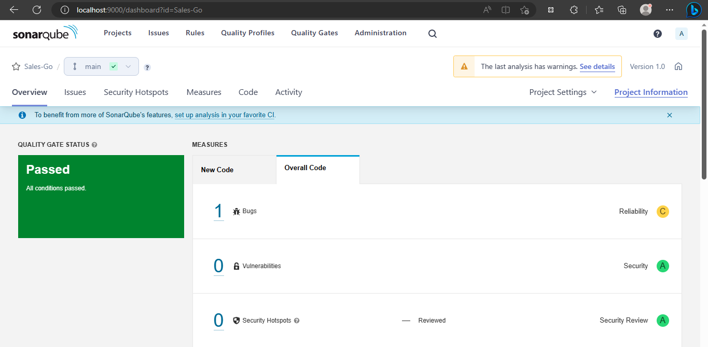
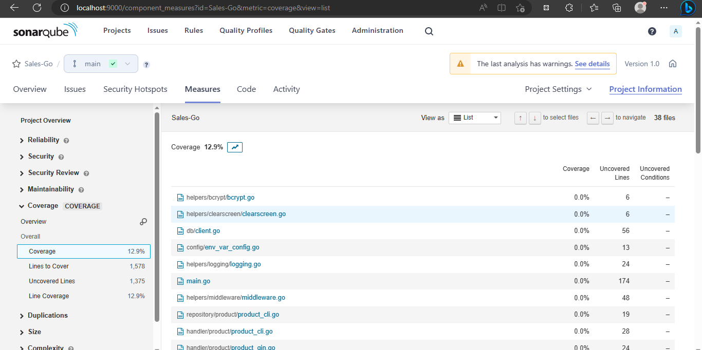

# Sonar Scanner

Sonnar scanner merupakan _software_ untuk mengecek _coverage_ dari unit testing. Idealnya unit test perlu di atas 80 %.

1. Buat sonnar project di dalam folder aplikasi Golang dengan nama sonar-project.properties.

<figure><figcaption></figcaption></figure>

```properties
sonar.projectKey=Sales-Go
sonar.projectName=Sales-Go

sonar.projectVersion=1.0
# source of program
sonar.sources=.
# source of program that will not be scanned by sonnar scanner
sonar.exclusions=**/helper/*,**/docs/**, **/mocks/**
sonar.ts.tslint.configPath=tslint.json
sonar.typescript.lcov.reportPaths=coverage/lcov.info

# testing needs config
sonar.test.inclusions=**/*_test.go
sonar.test.exclusions=**main.go, **/helper/*,**/docs/**, **/mocks/**
sonar.go.coverage.reportPaths=reports/result.out
```

2. Buat folder reports dan jalankan _command_ berikut untuk memperoleh file result.out.

```bash
go test ./... -v -coverpkg=./... -coverprofile=reports/result.out
```

Jika ingin generate result.html, bisa tambahkan _command_ go tool cover berikut.

```bash
go test ./... -v -coverpkg=./... -coverprofile=reports/result.out && go tool cover -html reports/result.out -o reports/result.html
```

3. File html dan out akan otomatis ter-generate.

<figure><figcaption></figcaption></figure>

4. Buka file result.html di browser, maka bisa dilihat coverage unit testing setiap file golang.

<figure><figcaption></figcaption></figure>

## Sonar Qube

Untuk file.out dapat digunakan pada Sonar Qube, yang merupakan _software_ berbasis web untuk mengecek coverage unit testing lebih dari 1 aplikasi golang. Instalasi sonar qube di docker dekstop dapat dilakukan dengan menjalankan _command_ berikut di CMD/bash/powershell. Pastikan sebelum _command_ tersebut dijalankan, docker dekstop sudah berjalan.

```
docker pull sonarqube
```

Setelah _command_ tersebut selesai di jalankan, image sonarqube akan muncul di tab images dokcer dekstop.

<figure><figcaption></figcaption></figure>

Jalankan sonarqube dengan alamat port yaitu 9000.

<figure><figcaption></figcaption></figure>

Setelah itu, cek localhost:9000 maka akan muncul tampilan berikut. Masukkan username dan password, selanjutnya akan diarahkan ke halaman project.

<figure><figcaption></figcaption></figure>

Untuk membuat project baru klik create project secara manual.

<figure><figcaption></figcaption></figure>

Pilih locally, untuk memiliki aplikasi di local computer yang ingin di cek coverage test-nya.

<figure><figcaption></figcaption></figure>

Ikuti langkah 1 dan 2, pastikan pilih sesuai bahasa pemrograman dan OS yang digunakan. Setelah itu salin token yang diperoleh.

<figure><figcaption></figcaption></figure>

Salin _command_ tersebut dan jalankan di tempat aplikasi golang yang ingin di cek coverage test-nya.

<figure><figcaption></figcaption></figure>

Setelah _command_ dari sonnar qube telah selesai dijalankan, tab overview di sonar qube akan otomatis berubah seperti di bawah ini.

<figure><figcaption></figcaption></figure>

Scroll ke bawah dan klik bagian angka di samping tanda %, maka akan diarahkan ke hamalan measurement coverage test masing-masing file yang mirip seperti tampilan result.html.

<figure><figcaption></figcaption></figure>

<figure><figcaption></figcaption></figure>

Referensi:




