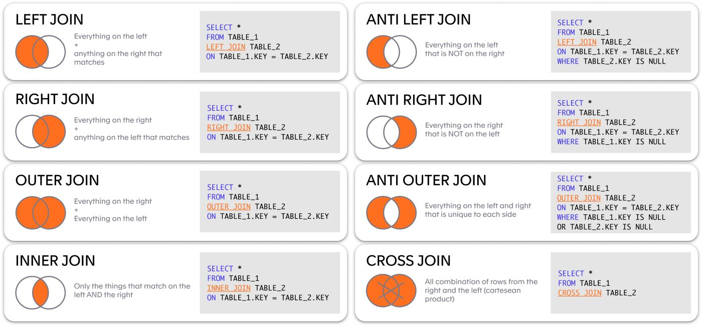

# SQL Join

SQL Join digunakan untuk menggabungkan 2 tabel. Berikut visualisasi tipe-tipe join di SQL.

<figure><figcaption>
<a href="https://th.bing.com/th/id/OIP.av8Om3HpG1MC7YTLKvyftgHaDc?pid=ImgDet&#x26;w=3487&#x26;h=1622&#x26;rs=1">https://th.bing.com/th/id/OIP.av8Om3HpG1MC7YTLKvyftgHaDc?pid=ImgDet&#x26;w=3487&#x26;h=1622&#x26;rs=1</a>
</figcaption></figure>

<figure><figcaption>
<a href="https://www.ionos.es/digitalguide/fileadmin/DigitalGuide/Screenshots_2018/Outer-Join.jpg">https://www.ionos.es/digitalguide/fileadmin/DigitalGuide/Screenshots_2018/Outer-Join.jpg</a>
</figcaption></figure>

## SQL Left dan Right Join

Contoh gambaran implementasi SQL left dan right join.

<figure><figcaption></figcaption></figure>
