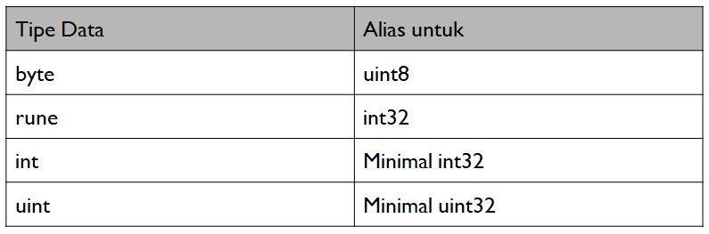

# Type Declaration Built-In di Golang

Golang juga memiliki tipe data built in menggunakan type declaration sebagai berikut.

<figure><figcaption><p>Sumber gambar : Dokumentasi Bootcamp PT Phincon</p></figcaption></figure>

## Rune dan Byte

Salah satu tipe data built in di Golang adalah rune dan byte. Perbedaan rune dan byte dapat diketahui dari konversi karakter non-ASCII (contohnya Ö) menjadi rune atau byte. Pada byte karakter non-ASCII saat di encode akan di ubah menjadi 2 byte, sementara di rune hanya menjadi 1 byte. Selain itu, byte juga digunakan untuk membuat string dan bisa direpresentasikan menggunakan rune. Byte mewakili karakter ASCII sementara Rune mewakili karakter Unicode.

### Contoh code rune dan byte

```go
package main
 
import (
    "fmt"
)
 
func main() {
    s := "GÖLANG PROGRAMMING golang programming" // Ö is a non-ASCII character 
 
    s_rune := []rune(s)
    s_byte := []byte(s)
     
    fmt.Println(s_rune)
    fmt.Println(s_byte)
    
    fmt.Println(string(s_byte))
    fmt.Println(string(s_rune))
}
```

```
[71 214 76 65 78 71 32 80 82 79 71 82 65 77 77 73 78 71 32 103 111 108 97 110 103 32 112 114 111 103 114 97 109 109 105 110 103]
[71 195 150 76 65 78 71 32 80 82 79 71 82 65 77 77 73 78 71 32 103 111 108 97 110 103 32 112 114 111 103 114 97 109 109 105 110 103]
```

### Contoh code looping string

Looping suatu string akan menghasilkan value dengan tipe data rune yang mewakili karakter Unicode.

```go
package main

import "fmt"

func main() {
    str := "Hello, 世界"
    for i, r := range str {
        fmt.Printf("index=%d, character=%#U\n", i, r)
    }
}

```

```
index=0, character=U+0048 'H'
index=1, character=U+0065 'e'
index=2, character=U+006C 'l'
index=3, character=U+006C 'l'
index=4, character=U+006F 'o'
index=5, character=U+002C ','
index=6, character=U+0020 ' '
index=7, character=U+4E16 '世'
index=10, character=U+754C '界'
```


Reference :&#x20;




