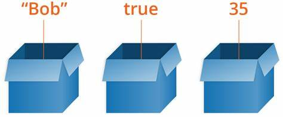

# Variable and Constant

Variabel dan const merupakan tempat untuk menyimpan suatu value baik sementara maupun tetap.

<figure><figcaption>
Sumber gambar : <a href="https://th.bing.com/th/id/OIP.sGtLqBeim4T-qt5X5pX06QHaDE?pid=ImgDet&#x26;rs=1">https://th.bing.com/th/id/OIP.sGtLqBeim4T-qt5X5pX06QHaDE?pid=ImgDet&#x26;rs=1</a>
</figcaption></figure>
