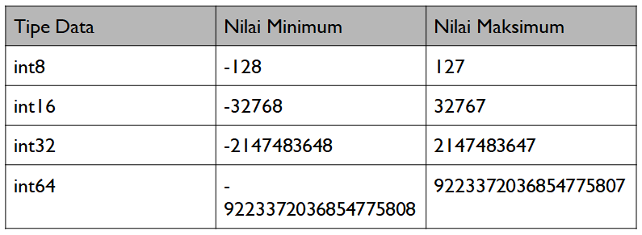
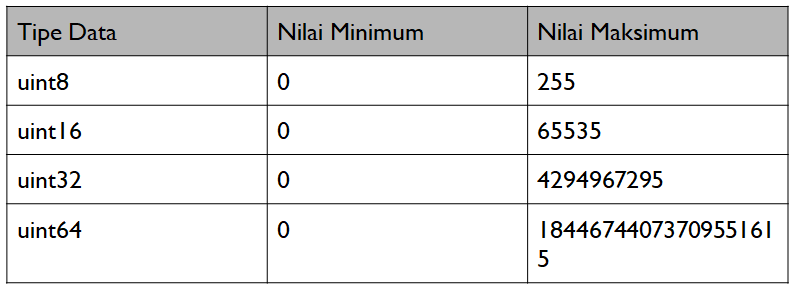

# Int32, Int64, Float32, Float64

Perbedaannya terletak pada jumlah nilai minimal dan maksimal yang bisa ditampung.

<figure><figcaption></figcaption></figure>

<figure><figcaption></figcaption></figure>

<figure><figcaption></figcaption></figure>

